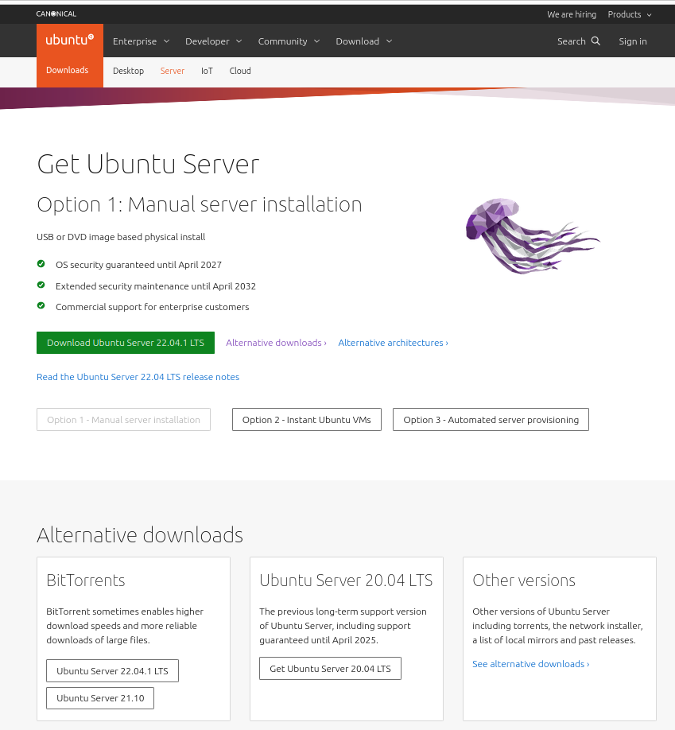

# Day 1

# Intro to DevOps

## 1. Fundamental DevOps

DevOps is a culture or method that shifts the way that Development and Operations team members work together. DevOps culture aims to maintain trust, collaboration, problem resolution, and continuous improvement across the entire team.

## 2. Operating System Concept

An Operating System is the software which manages physical computing resources, interfaces between the hardware and the applications on a computer.

## 3. Virtualization

Virtualization is the process that enables teams to create a useful virtual or simulated version/instance of the software on a single server.
The benefits of virtualization include: More agility, flexibility, and scalability during development.

# Making environment for server (CPU, Memory, Storage dan Network)

## Install Ubuntu Server 20.x with VMware
### Download Ubuntu Server
[Download](https://ubuntu.com/download/server)

### Download VMware
[Download](https://www.vmware.com/products/workstation-player/workstation-player-evaluation.html)

### Install VMware
1. Open the VMware and then Create a new virtual machine

2. Choose the Ubuntu Server

3. Insert user and password

4. Choose the Virtual Machine's name and location

5. Specify Disk Capacity

6. Choose customize hardware

7. Change the network adapter to Bridged

Note:
- Memory: virtual memory provides many function, including multitasking (multiple tasks executing at once on one CPU), allowing multiple processes to access the same shared library in memory, swapping, and others.
- Processors: virtual processor is a CPU core that is assigned to a virtual machine. There can be more virtual processors assigned than actual cores available, which allows virtual machines to share the same core.
- Network adapter: to connect virtual machine server into network

8. Increasing the system swap memory of the virtual machine

9. Choose language

10. Configure the network connection of the virtual machine

Note:
- DHCP (Dynamic Host Protocol Configuration) : The IP address change automatically following the network of the device
- Static : The IP address doesn't change and being set by admin

11. Edit ens33 IPv4 configuration to manual

12. Input the Subnet, Address, Gateway, and Name Servers

13. If successful click done

14. Configure proxy

15. Configure ubuntu archive mirror

16. Configure storage

Choose custom storage layout

17. Add GPT partition

18. Swap = backup storage

19. Ext4 = main storage

20. After succesful create partition click done

21. Confirm destructive action

22. Profile setup

23. SSH Setup

Check Install OpenSSH server

24. Install snaps if needed

25. Installing system

26. Reboot the virtual machine 

27. Login and then test the connection

