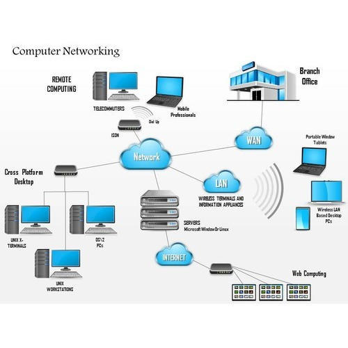
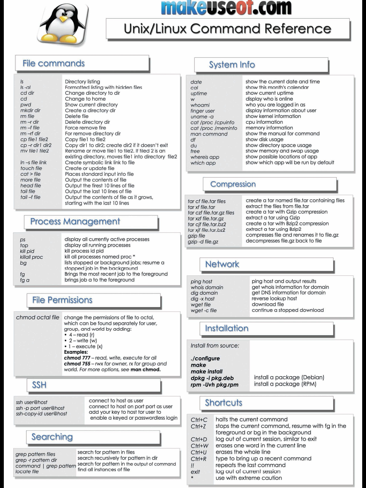

# Day 2

# Basic Shell and Computer Networking

## 1. Computer Network

Computer network is a system that connects numerous independent computing devices in order to transmit and share information (data) and resources with cable or wireless.



## 2. Linux Shell

A Linux Shell is a command-line interpreter based on UNIX or Linux, and commonly execute file manipulation, program execution, and text output. 

## 3. Linux Command



# Setup Computer Network

Setup computer network is a way of System Administrator or DevOps Engineer to change the default IP address on a server

1.  

```
sudo nano /etc/netplan/00-installer-config.yaml
```


After that: 
`sudo netplan apply`

2. Install putty


3. Test connection 

`ping google.com`


# Localtunnel

Localtunnel is a simple tool that provides you a publicly-accessible URL that reroutes every request to your locally-running process


## Install Localtunnel

1. Install node.js using nvm

`sudo apt install curl`

Note: curl is a command-line tool to transfer data to or from a server, using any of the supported protocols


2. Download and install nvm

NVM (Node Version Manager) is a command line tool that allows you to manage different versions of NodeJS.


3. Install localtunnel using npm

Note: npm is the package manager for Node.js


4. Run localtunnel

`lt --port 80`


## Install Apache2

1. 

`sudo apt install apache2`


2. Allow firewall for Apache2

`sudo ufw app list`


`sudo ufw allow 'Apache'`


`sudo ufw status`


3. Enable Apache2

`sudo systemctl enable apache2.service`


4. Test using IP address


5. Make tunnel to port 80 http apache


