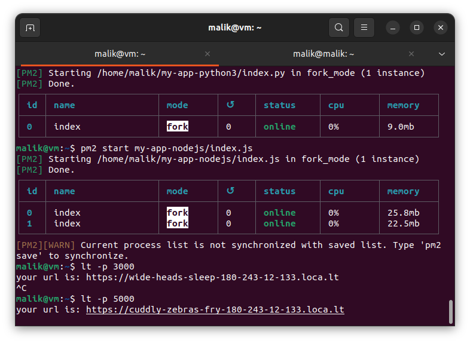
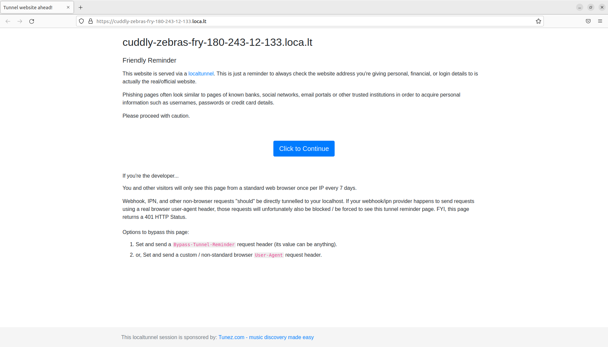

# Day 3

# Application in Server

An application, also referred to as an application program or application software, is a computer software package that performs a specific function directly for an end user or, in some cases, for another application.

# Simple Node.js App

1. Setup environment for Node.js


`npm init -y`

Command above used for initiate a Node.js project.


2. Install express JS

Express is a node js web application framework that provides broad features for building web and mobile applications. It is used to build a single page, multipage, and hybrid web application. It's a layer built on the top of the Node js that helps manage servers and routes.


3. Make the app

Make file `index.js` with script below

```
const express = require("express");
const app = express();
const port = 3000;

app.get("/", (req, res) => {
  res.send("Hello World!");
});
```


4. Run the app


5. Test using localhost


# Simple Go App

1. Setup environment for Go

Download and Install Go engine:

```
wget https://golang.org/dl/go1.16.5.linux-amd64.tar.gz && sudo su
```


```
rm -rf /usr/local/go && tar -C /usr/local -xzf go1.16.5.linux-amd64.tar.gz && exit
```


Insert path for Go on .bashrc

```
sudo nano .bashrc
```


```
export PATH=$PATH:/usr/local/go/bin
```


2. Make Go App

`nano index.go`

```
package main

import "fmt"

func main() {
    fmt.Println("Hello World!")
}
```


3. Run Go App

`go run index.go`


To build the app: `go build index.go`


Run again the app using command: `./index`


# Make Python App

1. Setup Python3 environment


Install python package manager:
`sudo apt install python3-pip`

Note: pip is the standard package manager for Python. It allows you to install and manage additional packages that are not part of the Python standard library.


Install flask
`pip install flask`

Note: Flask is a small and lightweight Python web framework that provides useful tools and features that make creating web applications in Python easier. It gives developers flexibility and is a more accessible framework for new developers since you can build a web application quickly using only a single Python file.


2. Make Python App

`nano index.py`

```
from flask import Flask
app = Flask(__name__)
@app.route("/")
def helloworld():
    return "Hello World"
if __name__ == "__main__":
    app.run(host="0.0.0.0")
```

3. Run the App

`python3 index.py`


4. Test from localhost


# Apache2 configuration for public access with localtunnel

1. Download and install pm2

`npm install pm2 -g`


2. Start both apps using pm2

`pm2 start my-app-nodejs/index.js`

`pm2 start my-app-python3/index.py --interpreter python3`


3. Open from browser


4. Tunneling the app

`lt -p 3000`

`lt -p 5000`






