# Day 4

# Version Control System

A version control system is a kind of software that helps the developer team to efficiently communicate and manage(track) all the changes that have been made to the source code along with the information like who made and what changes have been made.

# git

git is one of version control system that created by Linus Torvalds, which have top feature called distributed revision control is git storage not only in one storage. But everyone involved in the project will get the git database, which make it easier to manage both offline and online.

# Versioning using git

1. Setup git environment on Ubuntu

Install git
`sudo apt install git`

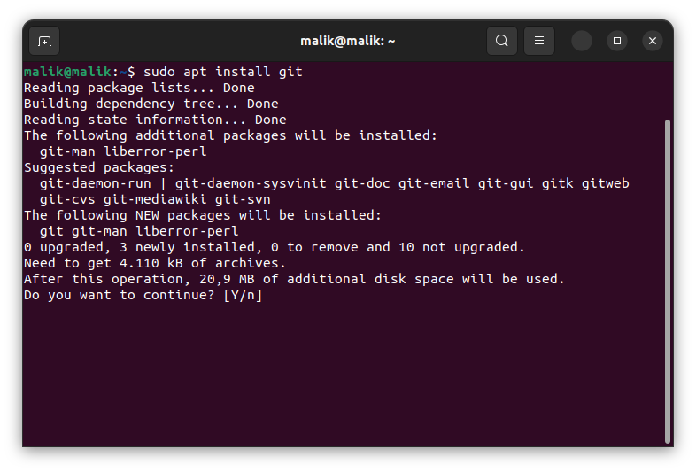

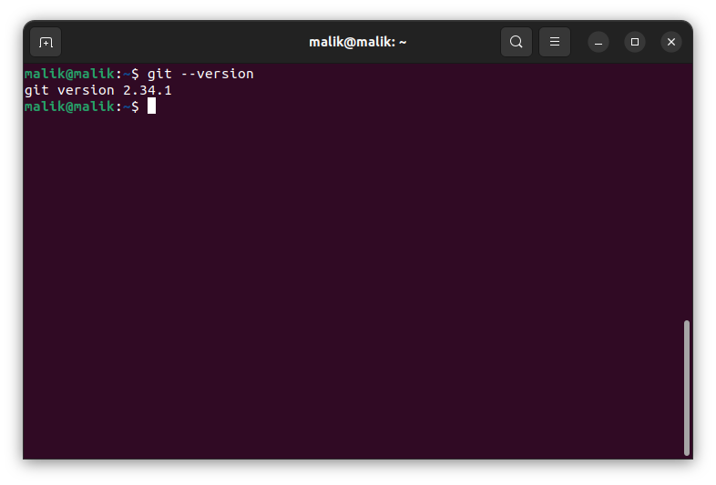

Config username, email, and SSH key

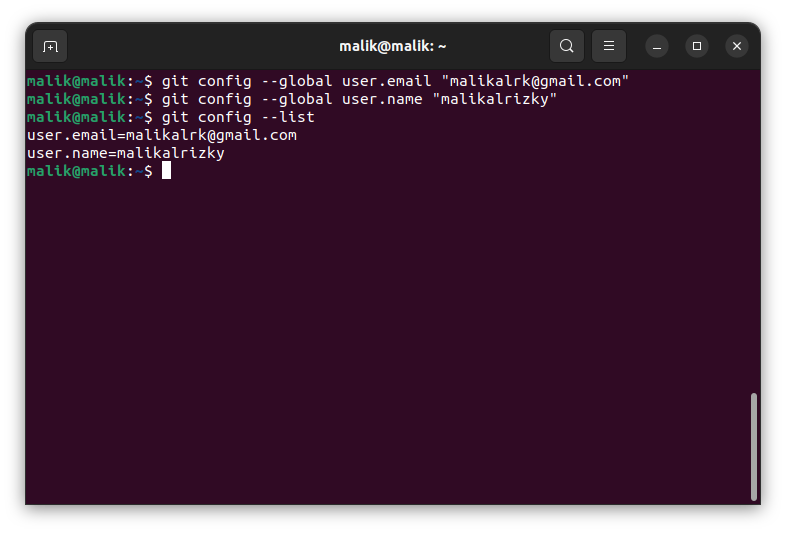

Make private/public key
`ssh-keygen`

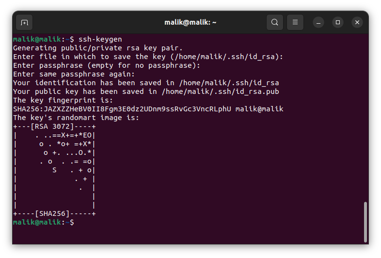

Open generated file
`cat ./.ssh/id_rsa.pub`

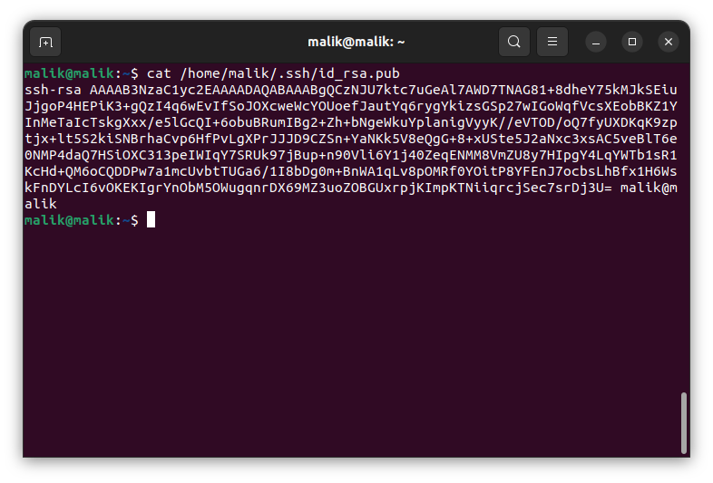

Go to profile settings

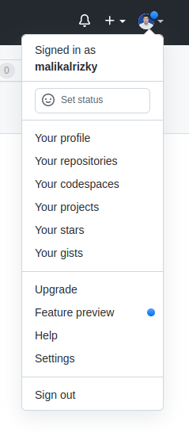

Choose SSH and GPG keys and enter the generated key

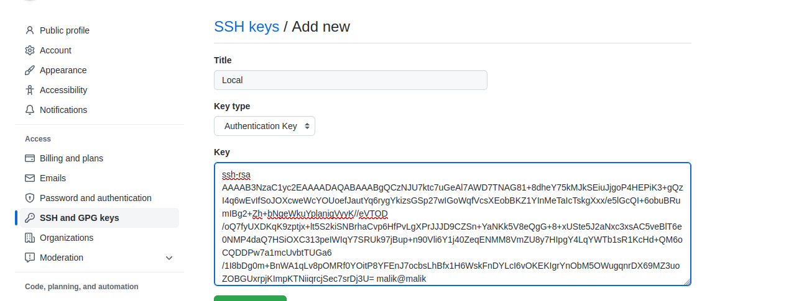

Test connection to Github

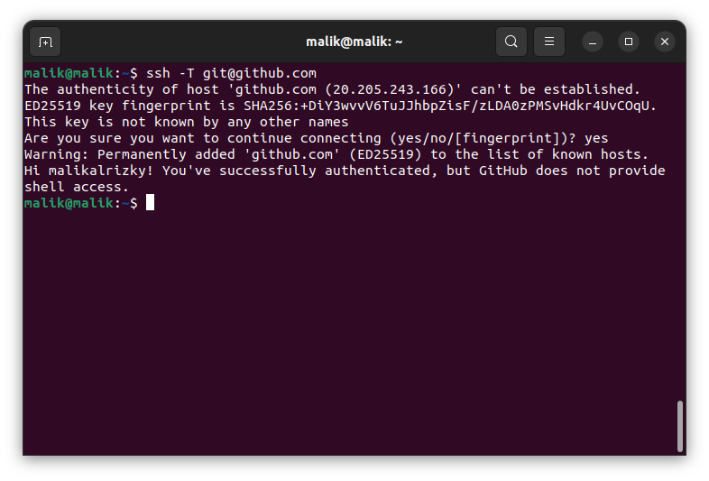

2. Making repository Github

`git init`

The git init command is used to initialize a new git repository or reinitialize an existing one. The git init command transforms the current directory into a Git repository.It will also create a new master branch.

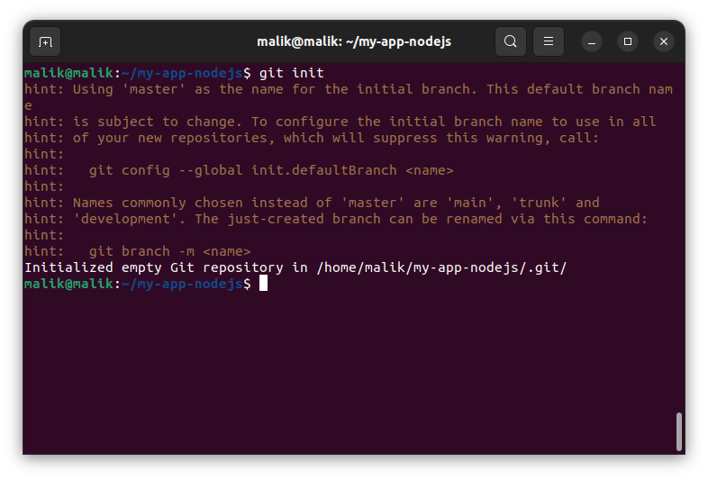

### Git Ignore

.gitignore file is a text file that tells Git which files or folders to ignore in a project.

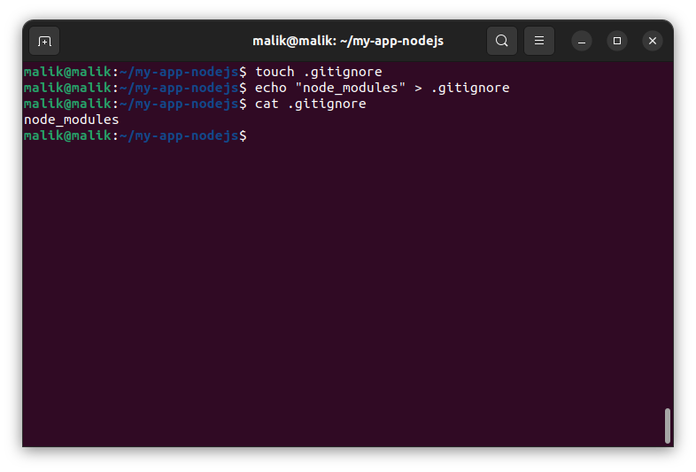

Adding file for committing

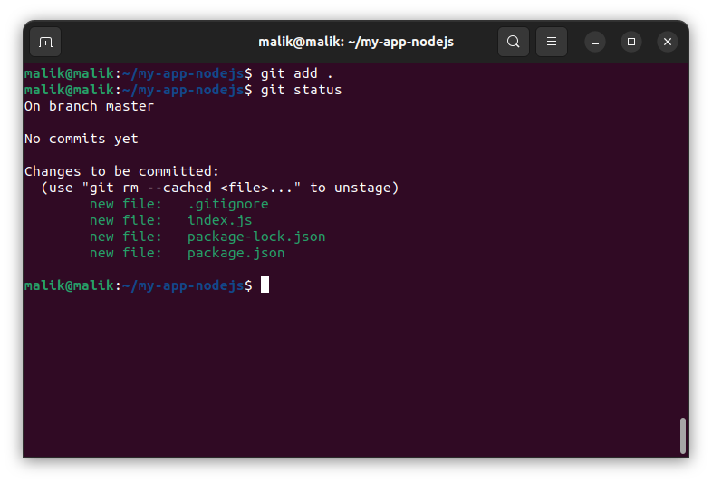

Creating repository

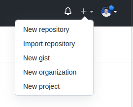

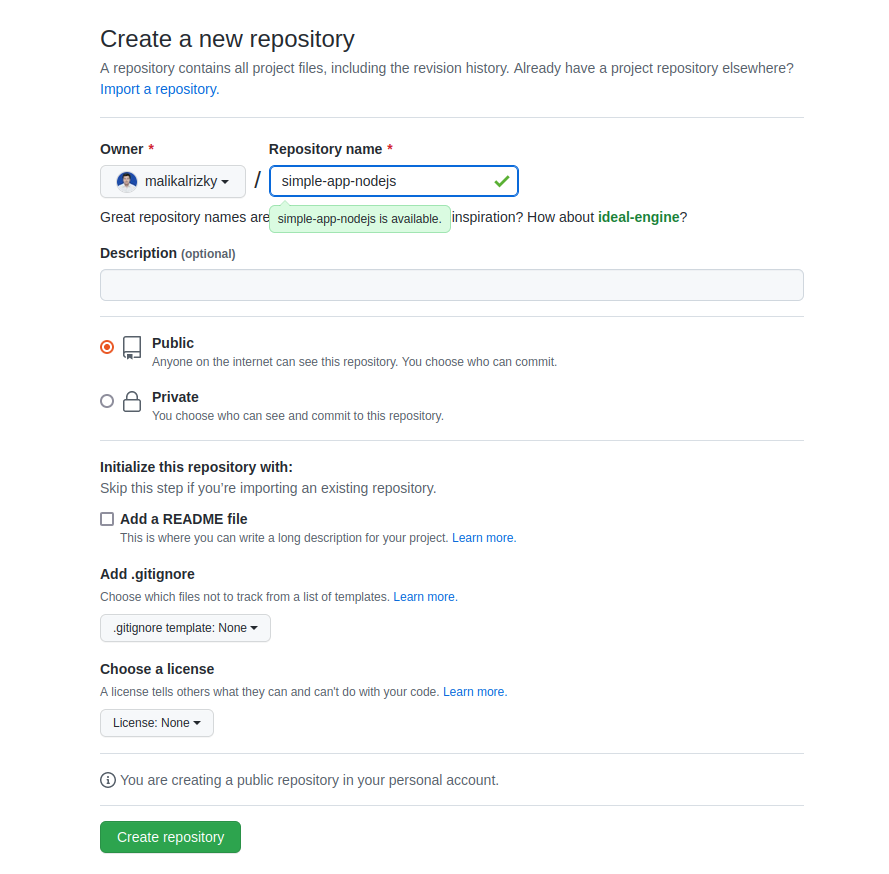

Copy SSH

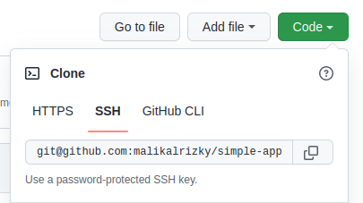

Commit into local repository

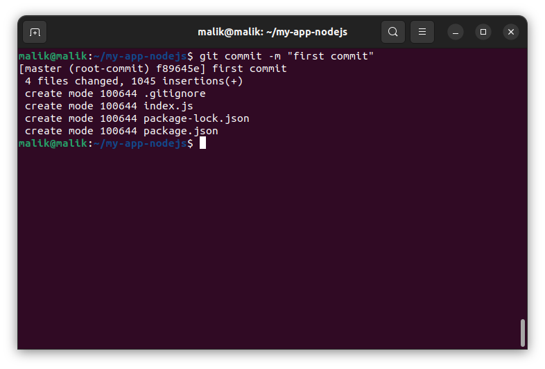

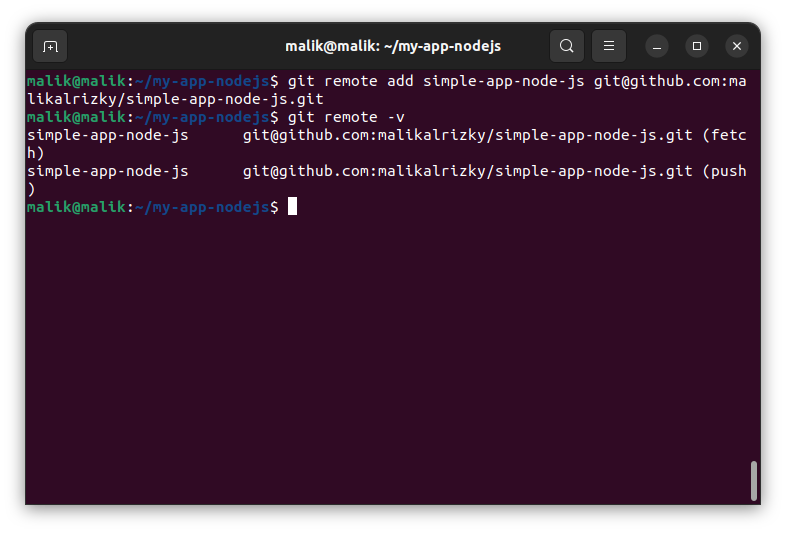

Push to sent file on local repository into github repository

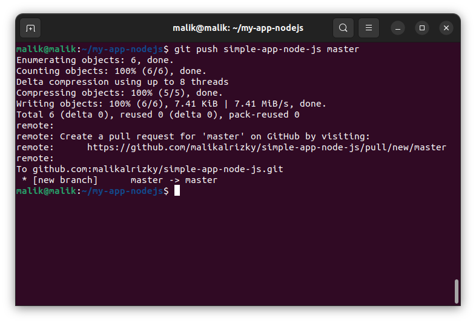

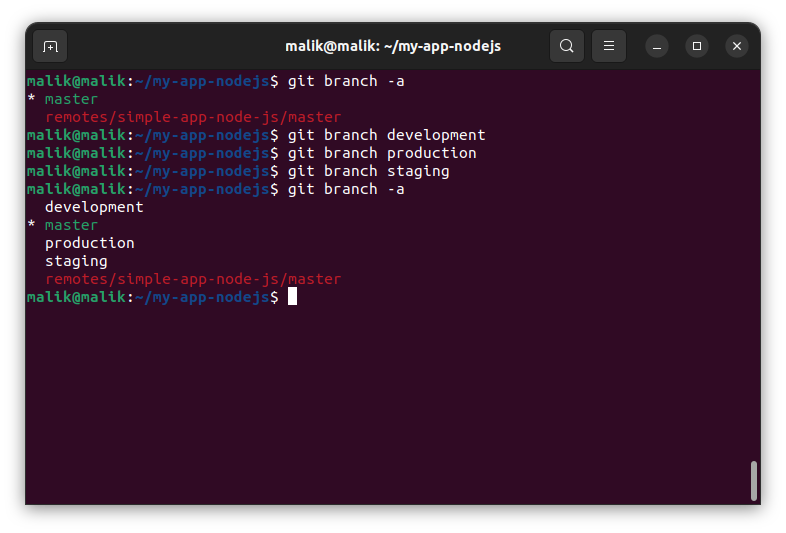

Create branch

Branching offers a way to work on a new feature without affecting the main codebase. This feature is very important to DevOps.

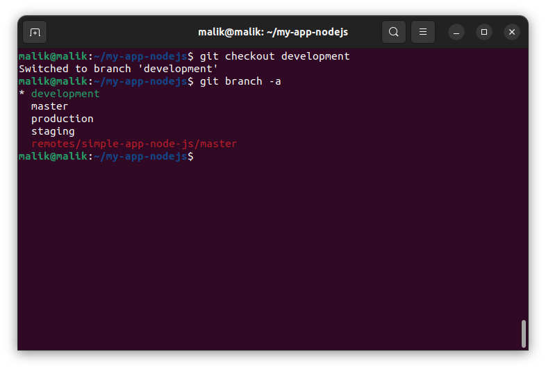

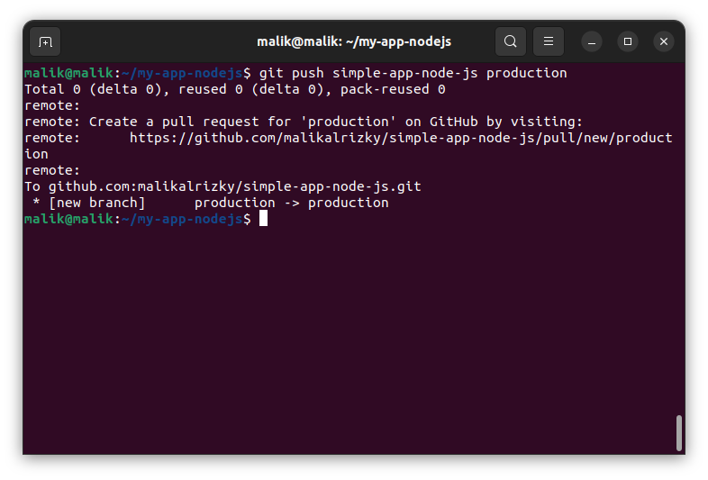
