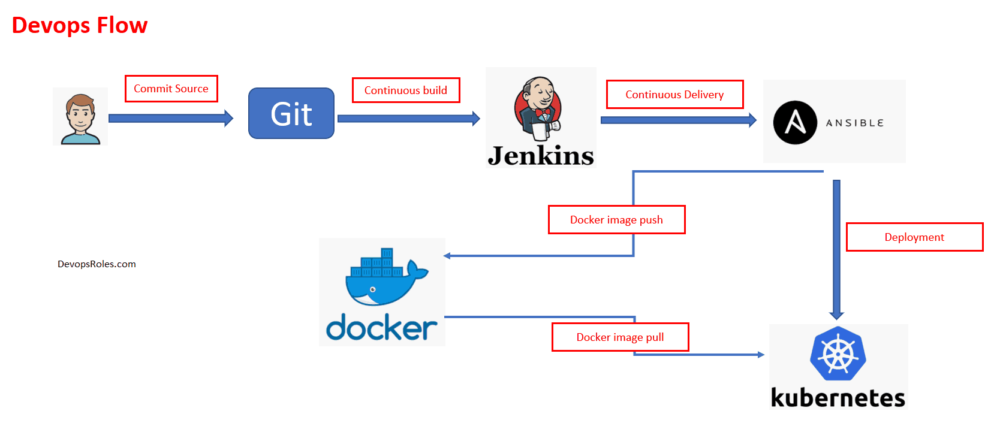
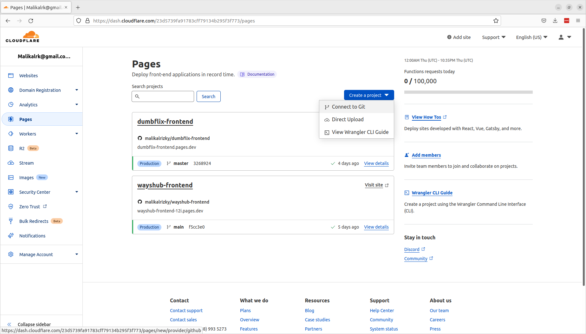
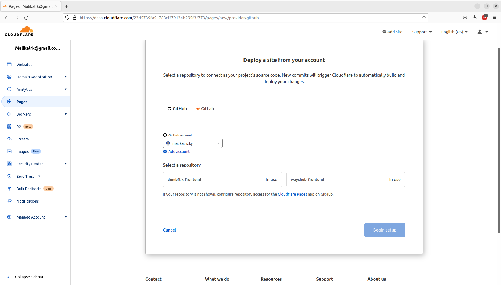
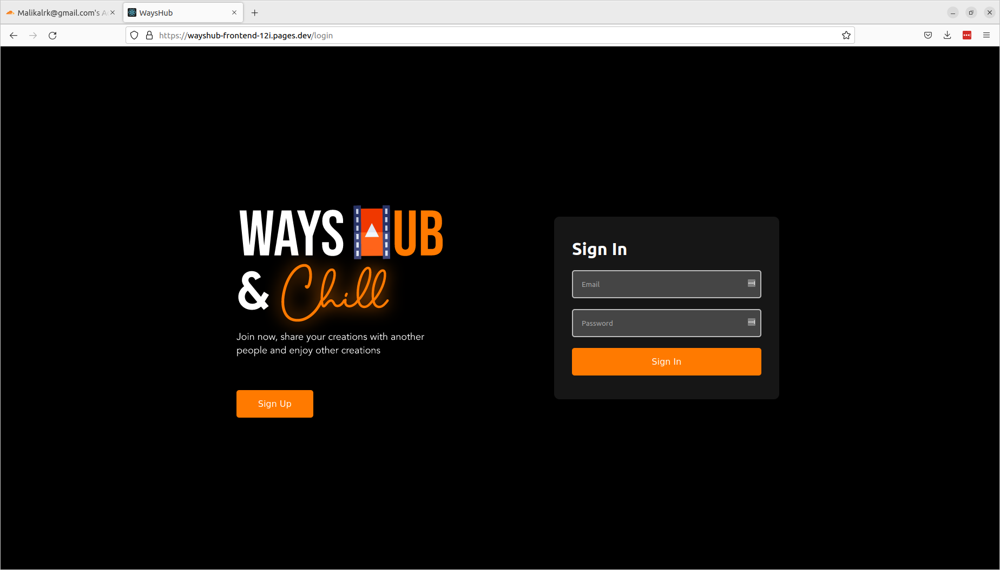
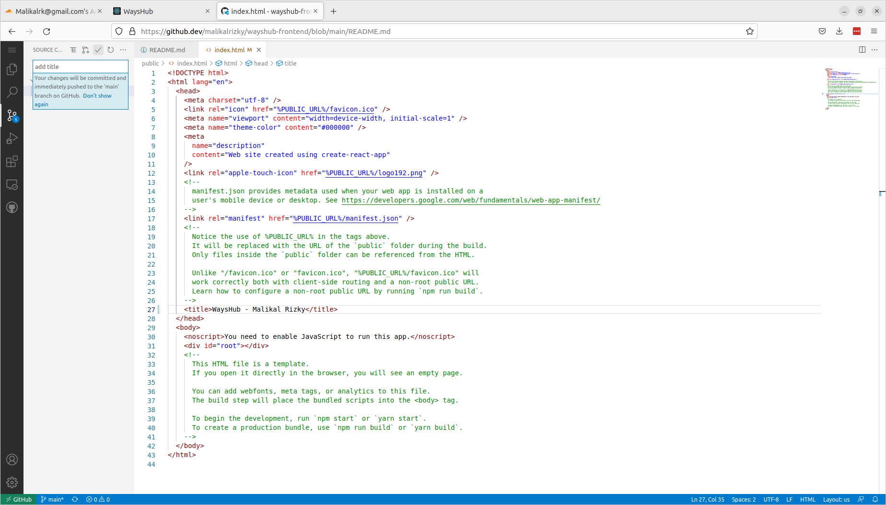
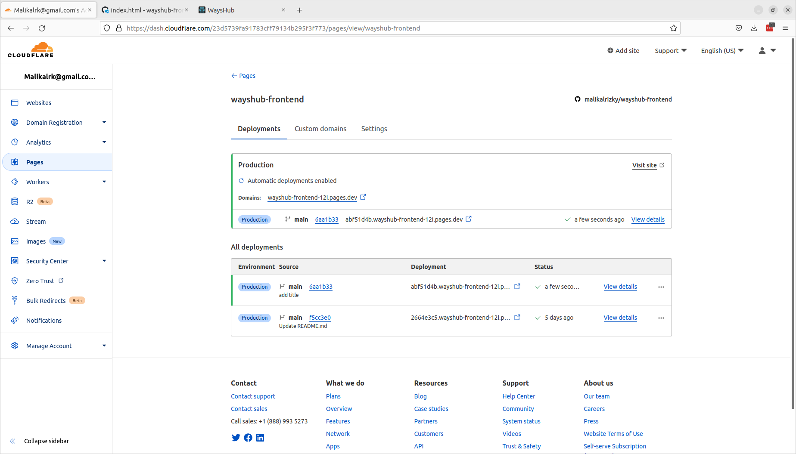
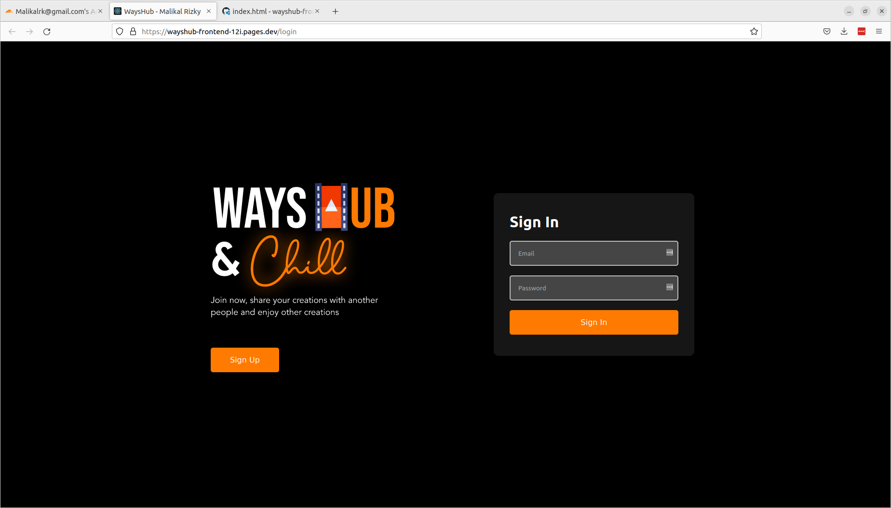

# Day 5

# CI CD with Cloudflare Pages

CI/CD is a method to frequently deliver apps to customers by introducing automation into the stages of app development. The main concepts attributed to CI/CD are continuous integration, continuous delivery, and continuous deployment.

CI/CD pipeline flow

# Deploy apps to Cloudflare Pages with Github

1. Create project and connect to git account

2. Select git repo and wait for the cloudflare pages automatically build

3. Open Domain

4. Edit index.html file and push

5. Wait for cloudflare pages to automatically build again and open the web again

