# Day 6

# Manage Server with Terminal

Terminal is a text-based command line interface used to control a computer or system where we can do many tasks such as control file and many more.

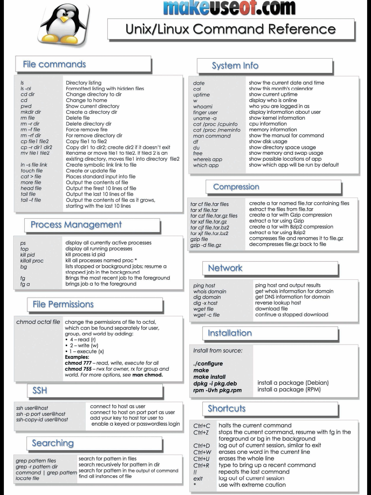

# Monitoring

## htop

### System wide cpu usage:

The numbers on the top left from 0 to 7 represents the number of cpu's/cores in my system with the progress bar next to them representing the load of cpu/core. As you would have noticed the progress bars can be comprised of different colors. The following list will explain what each color means.

    Blue: low priority processes (nice > 0)
    Green: normal (user) processes
    Red: kernel processes
    Yellow: IRQ time
    Magenta: Soft IRQ time
    Grey: IO Wait time

### System wide memory usage:

Below the cpu progress bars you will see the memory and swap progress bars. Like the cpu progress bars the memory and swap progress bars can be comprised of different colors. Here is a list of what the colors means within relation to the memory and swap progress bars.

    Green: Used memory pages
    Blue: Buffer pages
    Yellow: Cache pages

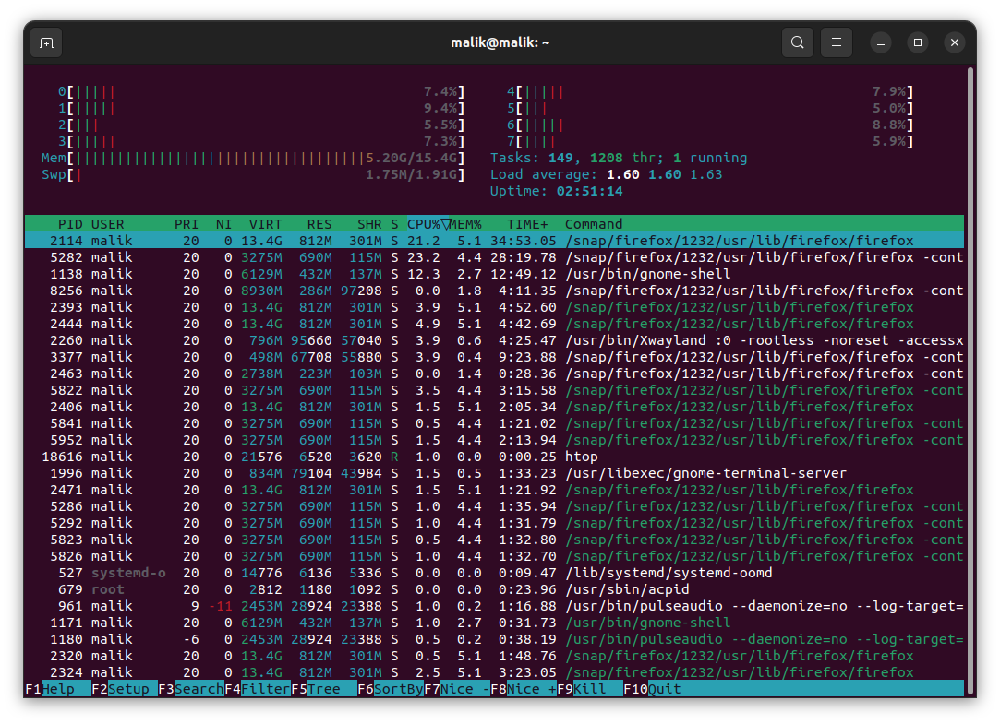

## nmon

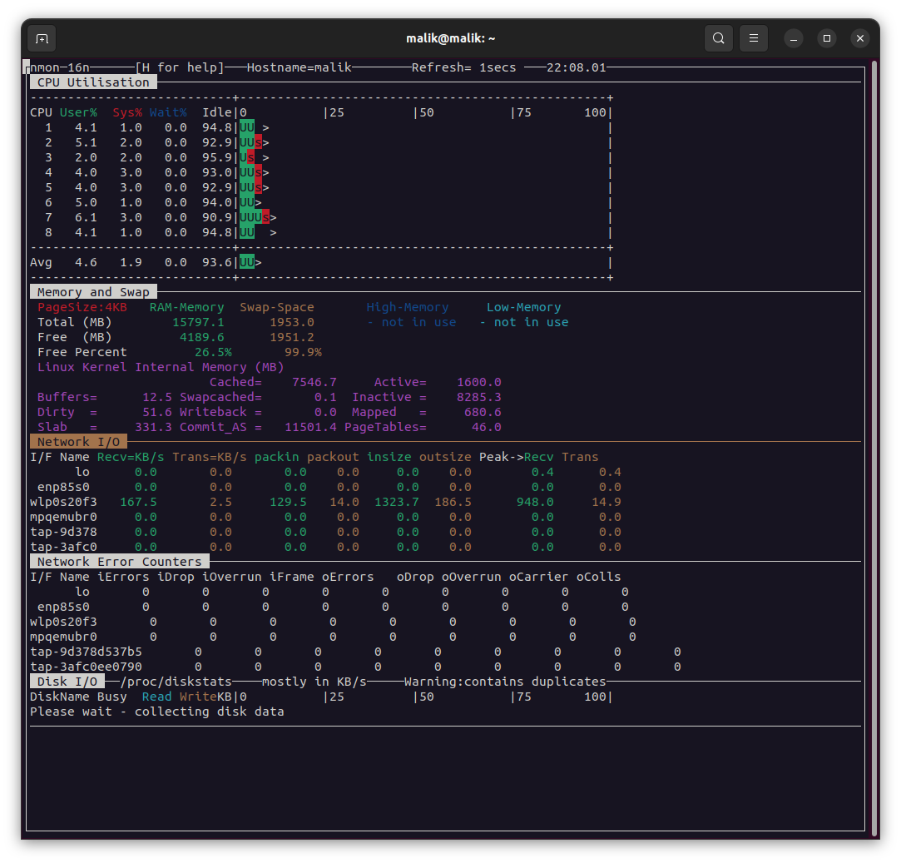

## lsof

Active file in system

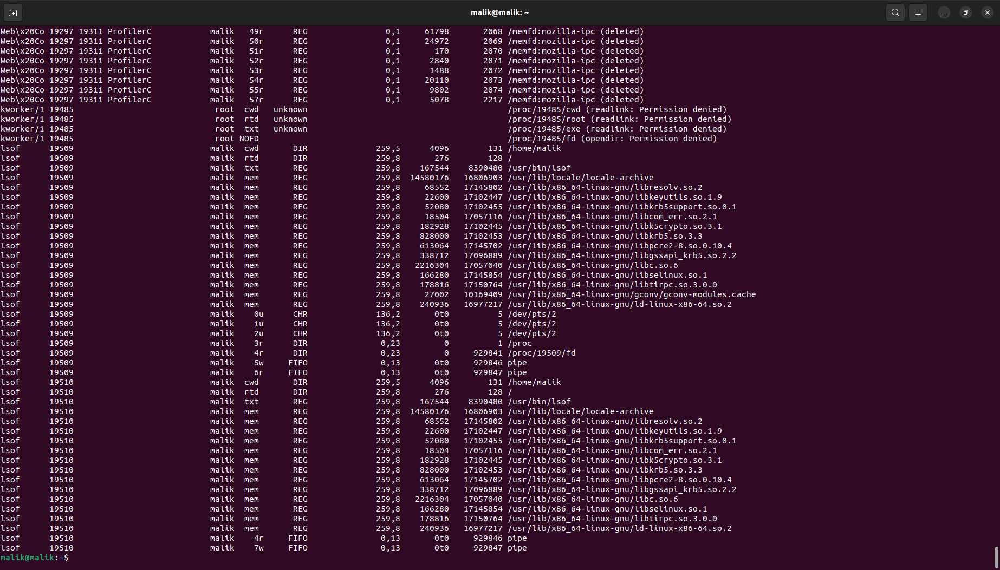

## ps

Active process in system

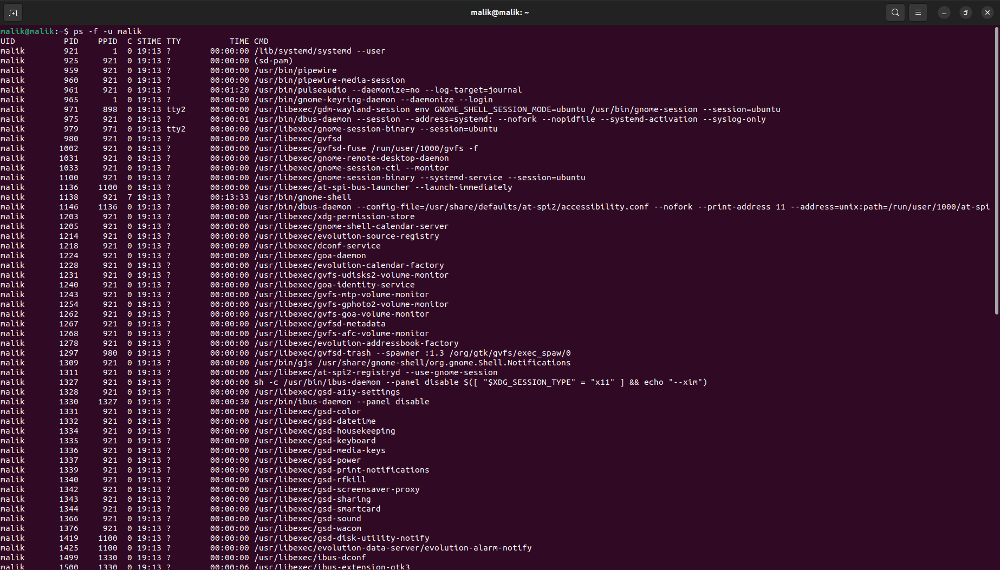

# Create bash script

A Bash script is a plain text file which contains a series of commands.

bash is sh, but with more features and better syntax. Bash is “Bourne Again SHell”, and is an improvement of the sh (original Bourne shell). Shell scripting is scripting in any shell, whereas Bash scripting is scripting specifically for Bash. sh is a shell command-line interpreter of Unix/Unix-like operating systems. sh provides some built-in commands. bash is a superset of sh. Shell is a command-line interface to run commands and shell scripts. 


## 1. Create Bash to update and upgrade

Create a new bash script and insert with command

```
#!/bin/bash

sudo apt update; sudo apt upgrade
```

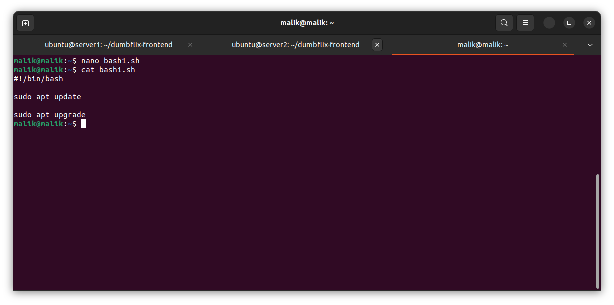

Add permission with command

```
chmod +x <file-name>
```

note: /bin/bash is owned by user "root"

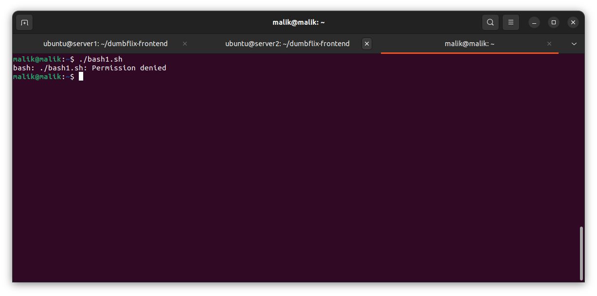

Run bash script with

`./<filename>`

or

`bash <filename>`

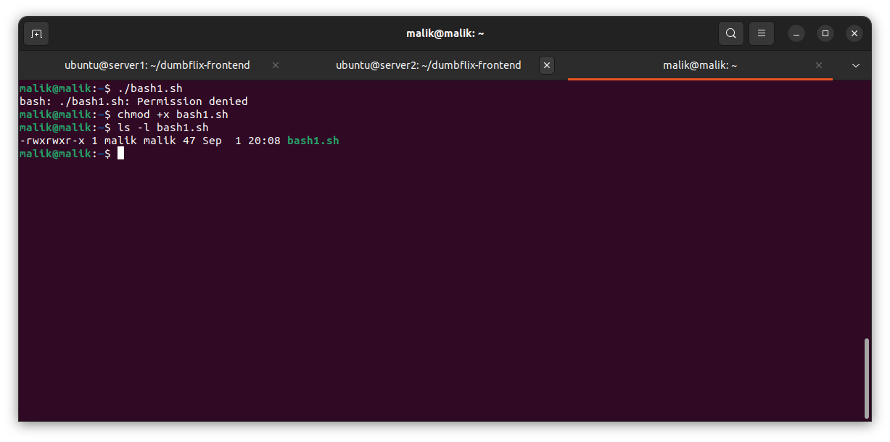

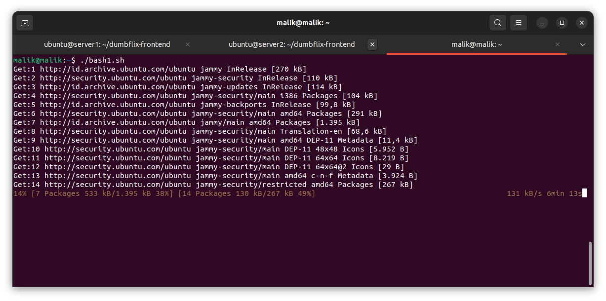

## 2. Create Bash to Open Firewall Port 22, 80, and 443

Create a new bash script and insert with command

```
#!/bin/bash

sudo ufw allow 22

sudo ufw allow 80

sudo ufw allow 443
```

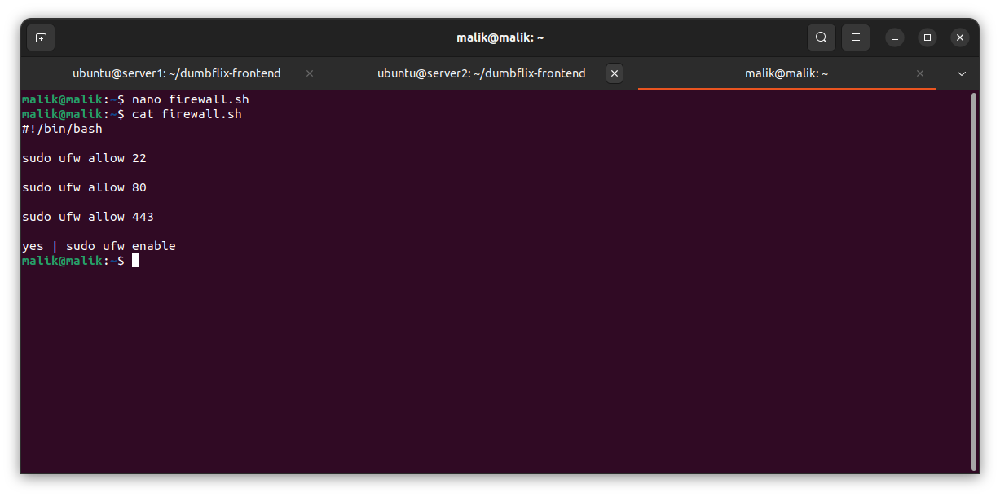

Add permission with command

```
chmod +x <file-name>
```

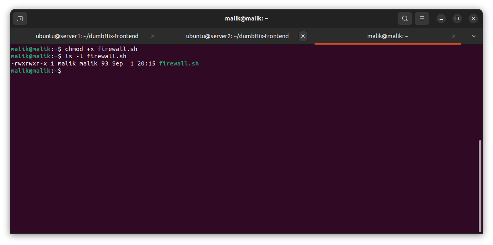

Run bash script with

`./<filename>`

or

`bash <filename>`

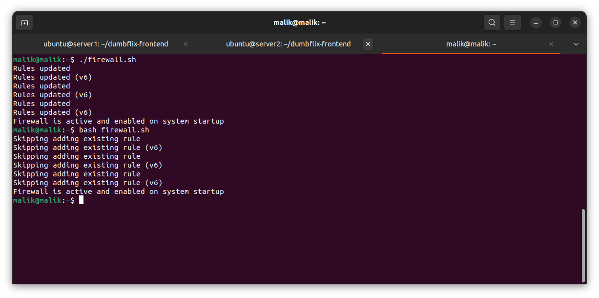