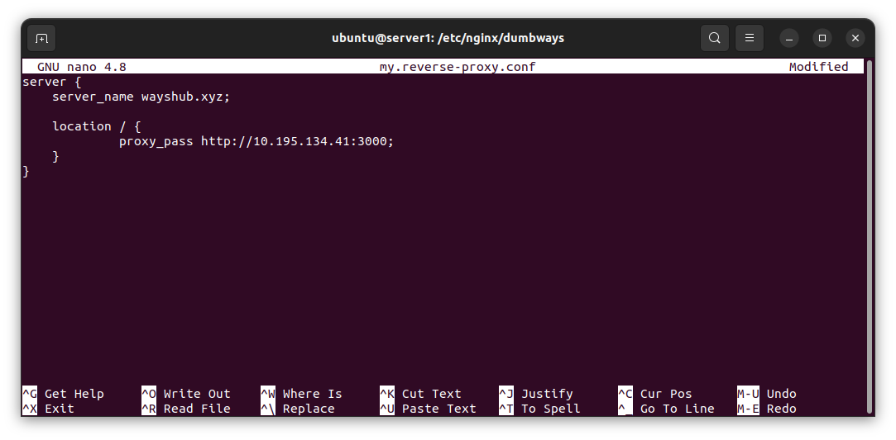
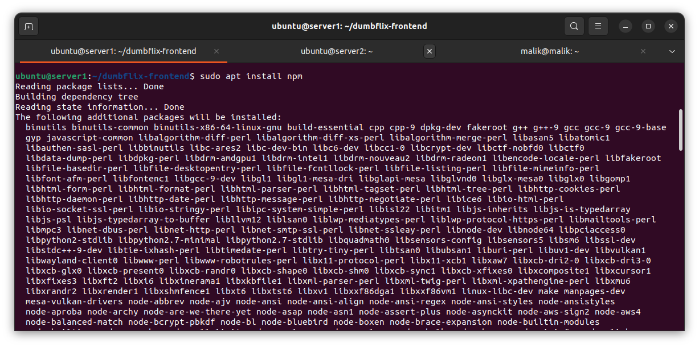
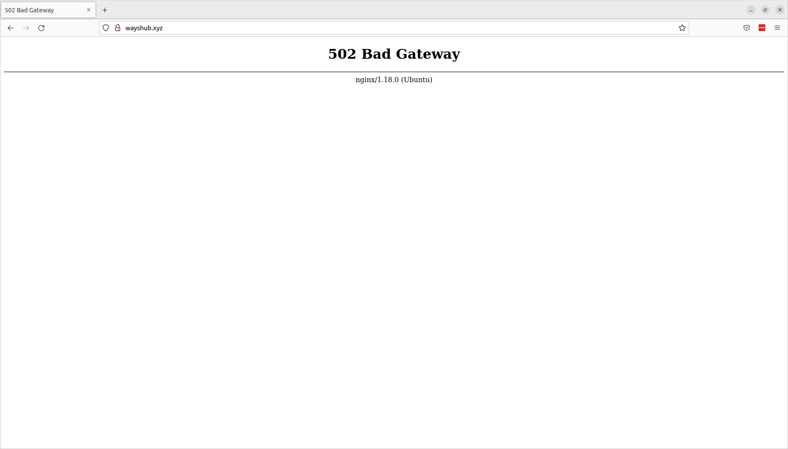

# Day 7

# Web Server and Load Balancing

A web server is a computer software and underlying hardware (processor and memory) that provides data-based services and to receive requests from client via HTTP or its secure variant HTTPS or usually called by web browser. Later, web server can send response on request in form of web page.

## Running Reverse Proxy and Load Balancing on Web Server

### 1. Setup Environment

This documentation is using [multipass](https://multipass.run/)


Create server for gateway and then remote into the server


Update and install nginx


Try connection


### 2. Create Reverse Proxy Config

Reverse proxy is a type of proxy server that typically sits behind the firewall in a private network and directs client requests to the appropriate backend server. A reverse proxy provides an additional level of abstraction and control to ensure the smooth flow of network traffic between clients and servers.


```
server { 
    server_name domain.com; 
    
    location / { 
             proxy_pass http://(ip):(port);
    }
}
```




### 3. Edit nginx config


### 4. Create virtual host

```
sudo nano /etc/hosts
```


Try the virtual host


### 5. Installing the app





Start app


### 6. Create Load Balancing Config

Load Balancing is a technique used to distribute workloads uniformly across servers or other compute resources to optimize network efficiency, reliability and capacity.


```
upstream domain { 
    server (ip):(port);
    server (ip):(port);
}
server { 
    server_name domain.com; 
    
    location / { 
             proxy_pass http://domain;
    }
}
```


One of the server died


Both server died



### 7. Install PM2 on Web Server

PM2 used so that the app can run in background without remote the server.

```
sudo npm install pm2@latest -g
```


```
pm2 start npm --name "name" -- start
```


Try exit the remote server


